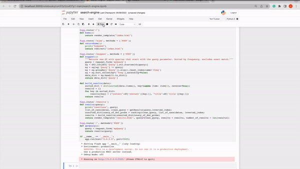

<h1>CS 437 Information Retrieval Project</h1>

<h3>Project Overview:</h3>
This is a search engine built using concepts of information retrieval learned from the CS437 course taught at Boise State University. The
project is a small scale search engine built using a small subset of the Wikipedia dataset. The goal of the project was to demonstrate learned concepts
by creating a functioning search engine where the emphasis was on quality of results rather then efficiency of the retrieval of them.

<h3>Tech Stack:</h3>
This project was written almost purely in Python using Jupyter Notebooks. The web application used Flask as the underlying server and used HTML,CSS, and JavaScript for the layout. The data that was used and preprocessed was stored locally on file.

<h2>Search Engine Report:</h2>

<h3>Implementation of Text Processing :</h3>

For the implementation of this project we used a lot of code we wrote from the previous homeworks as a starting point. The tokenizer we used was once again the work_tokenize from nltk and again we opted for lemmatization rather than stemming in our preprocessing using nltk’s WordNetLemmatizer. This was due to the fact that stemming resulted in a lack of meaning which makes it harder to return relevant results. We also used ntlks english stopword list in which we had appended punctuation to it to help remove the /r and /n present in the content of each document.

<h3>Statistics on Document Collection:</h3>

The number of documents present: 1,286,264

Index size prior to preprocessing: 244,435,249

Index size after preprocessing: 2,651,233

<h3>Implementation of Query Suggestions:</h3>

To implement query suggestions, we imported the query log into a dataframe to make manipulating the data easier. In this case, it was simpler to use a dataframe but to make it more efficient a dictionary could be used. We wrote a method that takes the query as a parameter and outputs all queries that begin with the input (excluding an exact match, as suggesting the inputted query would be pointless). These results are sorted by frequency, so the queries that q’ are most often modified to are presented first, as intended by the 𝑆𝑐𝑜𝑟𝑒(𝐶𝑄, 𝑞′) equation.

<h3>Implementation of Ranking:</h3>

Like instructed, the way we went about coming up with our ranking system was by using the inverted_index which in our case consisted of a dictionary where the key was equal to the specific word and the value was equal to a list of all the documents that the word could be found in. In our case we opted to account for the number of occurrences of each word in a particular document later outside the inverted_index in the case if the word appeared in the query in order to achieve a faster and more efficient computation.

To rank results, first we would read in the users query. The query was then cleaned to fit the preprocessing that all the words in the inverted index had experienced. From there we created a list of documents that consisted of all the documents in common between the query terms. If there were less than 50 documents in total we would take whatever documents remained in the query term that resulted in the least amount of total documents that that word was found in. We did this because the word with less occurrences was seen as more rare and therefore a better use in finding accurate results rather than using the more common query term.

From there we performed the actual ranking portion given a list of potential candidate documents retrieved from the previous step and ranked them similarly to how we ranked documents in homework 4: by taking the number of occurrences of a word in a document and dividing that number by the total number of words in that document. That value was then multiplied by the total number of documents in which the word appeared and divided by the total number of documents in the collection. For any word that was unseen before and or not in the inverted index a smoothing value of 0.00001 was applied in order to avoid errors due to dividing by 0. 

The documents were then added to a dictionary where the key was the Document ID number and the value was the probability of getting that document given the query in question. This dictionary was then sorted by descending order of value. Then a second dictionary was made and where the key was once again the document ID number and the value was a nested dictionary where the first key was the title of the document and the corresponding value was the actual title of that document. The second and last key in the nested dictionary’s key was content and it’s value consisted of the result of the cosine similarity between the query and the content of the document where the result was a sentence that contained the most related sentence to the query.This value was then sent over flask to an html page to be displayed in the browser.

The purpose of using dictionaries in this project served multiple purposes. One being that it allowed a lookup time of O(1) which is about as fast as you can get. Also flask will only allow dictionaries and strings to be sent over to an ajax function in javascript so using a dictionary was a must.

<h3>Implementation of snippet generation:</h3>

To generate snippets of relevant documents, we found the two sentences with the highest cosine similarity score with the query in each document. Originally, we used a dataframe to store this information but we chose to switch to a dictionary for efficiency, as the previous method slowed the calculation of results. To calculate the cosine similarity, we used the sklearn library’s TfIdfVectorizor function to create a matrix of TF-IDF scores for each word in the query and each sentence in a document. We also used sklearn’s cosine_similarity function to compare the relevancy of sentences, using the TF-IDF matrix as input, as it is an efficient implementation of the calculation that uses smoothing to avoid division by zero.

In some documents, there may be only one sentence that is of importance to the user based on the query. In these cases, we chose to only return one sentence instead of presenting one relevant sentence and one irrelevant sentence, as we felt that is more practical for a user.

<h2>Discussion:</h2>

<table>
  <tr>
   <td><strong>Query:</strong>
   </td>
   <td>
   </td>
   <td>Fried Chicken
   </td>
   <td>
   </td>
  </tr>
  <tr>
   <td><strong>Ranking</strong>
   </td>
   <td><strong>Document ID</strong>
   </td>
   <td><strong>Snippet</strong>
   </td>
   <td><strong>Ranking Score</strong>
   </td>
  </tr>
  <tr>
   <td><strong>1</strong>
   </td>
   <td>767511
   </td>
   <td>'sentence1': 'Tastee Fried Chicken  Tastee Fried Chicken (also known as "TFC" or "De Tastee Fried Chicken Nigeria LTD") is a fast food fried chicken restaurant based in Victoria Island, Lagos, Nigeria.',

 'sentence2': "In 2006, Tastee Fried Chicken launched a partnership with Oando, a petroleum company, that has begun locating Tastee Fried Chicken restaurants inside Oando's service stations."
   </td>
   <td>5.307e-09
   </td>
  </tr>
  <tr>
   <td><strong>2</strong>
   </td>
   <td>1271085
   </td>
   <td>'sentence1': 'It started as a pizzeria; however, later its owners decided to finally go into the fried chicken market.',

 'sentence2': ' '
   </td>
   <td>1.968e-09
   </td>
  </tr>
  <tr>
   <td><strong>3</strong>
   </td>
   <td>549593
   </td>
   <td>'sentence1': 'The primary factor that distinguishes Maryland fried chicken from other Southern fried chicken is that rather than cooking the chicken in several inches of oil or shortening, the chicken is pan-fried in a heavy (traditionally cast-iron) skillet and covered tightly after the initial browning so that the chicken steams as well as fries.',

 'sentence2': 'Other reported versions include: a fried chicken leg with ham and hush puppies (a batter made with flour, egg, oil, and milk or water, to which corn is added, then deep-fried); batter-fried chicken with hush-puppies and batter-fried bananas and pineapple rings; and bread-crumbed and fried chicken wings & drumsticks with sautéed bananas.'
   </td>
   <td>1.366e-09
   </td>
  </tr>
  <tr>
   <td><strong>4</strong>
   </td>
   <td>95089
   </td>
   <td>'sentence1': 'The restaurant serves fried chicken, catfish, chicken tenders, and side dishes.',

 'sentence2': "Chicken Express was established in 1988 by Richard and Nancy Stuart's Stuart Group Inc."
   </td>
   <td>1.09e-09
   </td>
  </tr>
  <tr>
   <td><strong>5</strong>
   </td>
   <td>924616
   </td>
   <td>'sentence1': 'In 1996, Golden Fried Chicken abbreviated to its present name, Golden Chick.',

 'sentence2': 'The first restaurant was in 1967 in San Marcos, Texas, under the name Golden Fried Chicken.'
   </td>
   <td>7.084e-10
   </td>
  </tr>
</table>

 We used the above query as just a basic test for the search engine, the intent was to see if we actually got results that had the bigram “fried chicken” in it just to see that it was working as intended. From the results it would appear that we had retrieved relevant documents.

<table>
  <tr>
   <td><strong>Query:</strong>
   </td>
   <td>
   </td>
   <td>Fried Chicken recipe
   </td>
   <td>
   </td>
  </tr>
  <tr>
   <td><strong>Ranking</strong>
   </td>
   <td><strong>Document ID</strong>
   </td>
   <td><strong>Snippet</strong>
   </td>
   <td><strong>Ranking Score</strong>
   </td>
  </tr>
  <tr>
   <td><strong>1</strong>
   </td>
   <td>549593
   </td>
   <td>'sentence1': 'The primary factor that distinguishes Maryland fried chicken from other Southern fried chicken is that rather than cooking the chicken in several inches of oil or shortening, the chicken is pan-fried in a heavy (traditionally cast-iron) skillet and covered tightly after the initial browning so that the chicken steams as well as fries.',

 'sentence2': 'Other reported versions include: a fried chicken leg with ham and hush puppies (a batter made with flour, egg, oil, and milk or water, to which corn is added, then deep-fried); batter-fried chicken with hush-puppies and batter-fried bananas and pineapple rings; and bread-crumbed and fried chicken wings & drumsticks with sautéed bananas.'
   </td>
   <td>2.202e-14
   </td>
  </tr>
  <tr>
   <td><strong>2</strong>
   </td>
   <td>552650
   </td>
   <td>'sentence1': 'Chicken balls  Chicken balls are a food consisting of small, spherical or nearly spherical pieces of chicken.',

 'sentence2': 'The dish consists of small chunks of fried chicken breast meat covered in a crispy batter coating.'
   </td>
   <td>5.099e-15
   </td>
  </tr>
  <tr>
   <td><strong>3</strong>
   </td>
   <td>820135
   </td>
   <td>'sentence1': 'It is famous for its skinless fried chicken products and for their signature fried chicken having 25% less fat than traditional fried chicken.',

 'sentence2': "Pudgie's Famous Chicken was founded in 1981 in Bethpage, New York by George Sanders, who developed a secret batter recipe and skinning progress."
   </td>
   <td>3.759e-15
   </td>
  </tr>
  <tr>
   <td><strong>4</strong>
   </td>
   <td>895406
   </td>
   <td>'sentence1': 'It was originally called Chicken and Spice and Virginia Fried Chicken.',

 'sentence2': 'While the recipe was not published, the chicken was cooked in special pressure-cookers and the process involved soaking the chicken in salt water.'
   </td>
   <td>3.188e-15
   </td>
  </tr>
  <tr>
   <td><strong>5</strong>
   </td>
   <td>356290
   </td>
   <td>'sentence1': 'Chicken Marengo  Chicken Marengo is a French dish consisting of a chicken sautéed in oil with garlic and tomato, garnished with fried eggs and crayfish.',

 'sentence2': 'The dish is similar to chicken à la Provençale, but with the addition of egg and crayfish, which are traditional to Chicken Marengo but are now often omitted.'
   </td>
   <td>2.238e-15
   </td>
  </tr>
</table>

The intent behind the above query was to find relevant recipes for fried chicken. Looking at the results it looks like our search engine was on the right track as the top results contained steps in making fried chicken. However, none of the results contained information on quantities and any real linear start to finish path for making fried chicken but just generally how it was made at a restaurant. This is probably just a dataset issue more than anything.

<table>
  <tr>
   <td><strong>Query:</strong>
   </td>
   <td>
   </td>
   <td>Donald Trump
   </td>
   <td>
   </td>
  </tr>
  <tr>
   <td><strong>Ranking</strong>
   </td>
   <td><strong>Document ID</strong>
   </td>
   <td><strong>Snippet</strong>
   </td>
   <td><strong>Ranking Score</strong>
   </td>
  </tr>
  <tr>
   <td><strong>1</strong>
   </td>
   <td>4521
   </td>
   <td>'sentence1': 'List of proclamations by Donald Trump  Listed below is the Presidential proclamations beginning with signed by United States President Donald Trump.',

 'sentence2': '&lt;onlyinclude>As of January 4, 2018, there have been 118 Presidential proclamations signed by President Trump.&lt;/onlyinclude>'}
   </td>
   <td>5.432e-09
   </td>
  </tr>
  <tr>
   <td><strong>2</strong>
   </td>
   <td>8187
   </td>
   <td>'sentence1': "Nazakhtar Nikakhtar  Nazakhtar Nikakhtar is an American lawyer and President Donald Trump's nominee for Assistant Secretary of Commerce (Industry and Analysis).",

 'sentence2': ' '
   </td>
   <td>4.400e-09
   </td>
  </tr>
  <tr>
   <td><strong>3</strong>
   </td>
   <td>1061583
   </td>
   <td>'sentence1': 'In the census of 1911 there were 32 registered family names  Birthplace of Donald Trump',

 'sentence2': ' '
   </td>
   <td>4.068e-09
   </td>
  </tr>
  <tr>
   <td><strong>4</strong>
   </td>
   <td>911539
   </td>
   <td>'sentence1': 'In February 2017, the newspaper received international attention when it mistakenly published an image of Alec Baldwin portraying Donald Trump, the 45th President of the United States, instead of Donald Trump himself.',

 'sentence2': ' '
   </td>
   <td>1.636e-09
   </td>
  </tr>
  <tr>
   <td><strong>5</strong>
   </td>
   <td>1098747
   </td>
   <td>'sentence1': 'Voted for Donald Trump and Mike Pence:  Voted for Mitt Romney and Paul Ryan:   Voted for John McCain and Sarah Palin:',

 'sentence2': ' '
   </td>
   <td>1.193e-09
   </td>
  </tr>
</table>

The intent in the query above was to retrieve information on former president Donald Trump. The results were questionable in this case as certainly the top results contain instances of the “donald trump” in them, but the content of them was quite short so there was a lack of information.

<table>
  <tr>
   <td><strong>Query:</strong>
   </td>
   <td>
   </td>
   <td>Barack Obama
   </td>
   <td>
   </td>
  </tr>
  <tr>
   <td><strong>Ranking</strong>
   </td>
   <td><strong>Document ID</strong>
   </td>
   <td><strong>Snippet</strong>
   </td>
   <td><strong>Ranking Score</strong>
   </td>
  </tr>
  <tr>
   <td><strong>1</strong>
   </td>
   <td>148539
   </td>
   <td>'sentence1': 'Obama (disambiguation)  Barack Obama (born 1961) is a former President of the United States.',

 'sentence2': 'Obama may also refer to:'
   </td>
   <td>3.45e-09
   </td>
  </tr>
  <tr>
   <td><strong>2</strong>
   </td>
   <td>379986
   </td>
   <td>'sentence1': 'David Axelrod (disambiguation)  David Axelrod (born 1955) is a senior advisor to former U.S. President Barack Obama.',

 'sentence2': ' '
   </td>
   <td>8.547e-10
   </td>
  </tr>
  <tr>
   <td><strong>3</strong>
   </td>
   <td>1062747
   </td>
   <td>'sentence1': 'She continued to serve in that position in the Administration of President Barack Obama until Mr. Obama named Cindy S. Moelis as her successor in April 2009.',

 'sentence2': ' '
   </td>
   <td>5.118e-10
   </td>
  </tr>
  <tr>
   <td><strong>4</strong>
   </td>
   <td>971177
   </td>
   <td>'sentence1': 'US President Barack Obama stayed there in his visit in April 2014.',

 'sentence2': ' '
   </td>
   <td>4.075e-10
   </td>
  </tr>
  <tr>
   <td><strong>5</strong>
   </td>
   <td>136115
   </td>
   <td>'sentence1': 'Senators have won: Barack Obama, Everett Dirksen, Al Franken, and Hillary Clinton.',

 'sentence2': ' '
   </td>
   <td>1.963e-10
   </td>
  </tr>
</table>

Like the previous query, the intent in the query above was to retrieve information on the past president Barack Obama in hopes to find better results than were found for Donald Trump. Again the results were questionable but slightly better then the previous query as there was more specific information about Barack than Donald but still the overall content of each document was pretty small.

<table>
  <tr>
   <td><strong>Query:</strong>
   </td>
   <td>
   </td>
   <td>Pizza
   </td>
   <td>
   </td>
  </tr>
  <tr>
   <td><strong>Ranking</strong>
   </td>
   <td><strong>Document ID</strong>
   </td>
   <td><strong>Snippet</strong>
   </td>
   <td><strong>Ranking Score</strong>
   </td>
  </tr>
  <tr>
   <td><strong>1</strong>
   </td>
   <td>495692
   </td>
   <td>'sentence1': 'Pizza Connection  Pizza Connection may refer to:',

 'sentence2': ' '
   </td>
   <td>0.000227
   </td>
  </tr>
  <tr>
   <td><strong>2</strong>
   </td>
   <td>505841
   </td>
   <td>'sentence1': 'Pizza (disambiguation)  Pizza is a popular Italian dish.',

 'sentence2': 'Pizza may also refer to:'
   </td>
   <td>0.001609
   </td>
  </tr>
  <tr>
   <td><strong>3</strong>
   </td>
   <td>855257
   </td>
   <td>'sentence1': '241 Pizza competes with other pizza chains such as Pizza Pizza, Pizza Hut, Little Caesars, and Pizza Nova.',

 'sentence2': '241 Pizza was founded in Toronto in 1986.'
   </td>
   <td>0.000107
   </td>
  </tr>
  <tr>
   <td><strong>4</strong>
   </td>
   <td>323685
   </td>
   <td>'sentence1': 'The stuffed crust pizza was popularized by Pizza Hut which debuted this style of pizza in 1995.',

 'sentence2': 'Pizza Hut hired Donald Trump to advertise the pizza.'
   </td>
   <td>9.560e-05
   </td>
  </tr>
  <tr>
   <td><strong>5</strong>
   </td>
   <td>1099551
   </td>
   <td>'sentence1': 'Other pizza companies also later included pan pizza.',

 'sentence2': "In 1989, Domino's Pizza introduced its deep dish or pan pizza."
   </td>
   <td>8.744e-05
   </td>
  </tr>
</table>

Lastly as the unigram test we tested the query “pizza”  to see what information we could get on it. In this case given that we only searched for pizza without any sort of context I would say the results were very good as they consisted of either restaurant information that served pizza or an actual definition of pizza.

Overall based on the results from each of the individual queries I would say that the results were as good as one could expect using our ranking algorithm and the given dataset. For certain queries such as the ones that consisted of past president names the results were slightly underwhelming in that they didn’t possess as much information on the president as I would hope. The top results just happened to be a sentence long which just makes the ratio of the president's name high in the document being that there's only a handful of words in total in the first place. So it makes sense that we got those results. For the other queries like fried chicken/fried chicken recipes and pizza I was honestly impressed how good the results were. Most of them weren’t short in content length and actually contained information one might hope to retrieve given this dataset. As far as the project goes overall I would say in general it went rather smoothly. The biggest issue we ran into and will most certainly try to address for project 2 is dealing with and processing such a large dataset. There were multiple times when preprocessing functions had to be rewritten in order to achieve a realistic computation time relative to when the project was due. The decision to compute the number of occurrences of a word in a document during the time of searching rather than with the creation of the inverted index was made so that the inverted index wouldn't take days/weeks to compute. However this did lead to a slower searching time ultimately which we intend to address in the next project as well. To add to that, there was also the issue of running out of RAM due to needing to access the two datasets along with the inverted index on top of the frontend portion. Fortunately due to having access to a physical server this problem was easily fixed when attempting to run the entire project. However for testing we used subsets of the data in order to understand how the program was functioning as we developed it.

<table>
  <tr>
   <td><strong>Query:</strong>
   </td>
   <td>fried chicken
   </td>
   <td>
   </td>
  </tr>
  <tr>
   <td><strong>Ranking</strong>
   </td>
   <td><strong> Candidate Suggestion</strong>
   </td>
   <td><strong>Score</strong>
   </td>
  </tr>
  <tr>
   <td><strong>1</strong>
   </td>
   <td>fried chicken recipes
   </td>
   <td>0.42
   </td>
  </tr>
  <tr>
   <td><strong>2</strong>
   </td>
   <td>fried chicken recipe
   </td>
   <td>0.210
   </td>
  </tr>
  <tr>
   <td><strong>3</strong>
   </td>
   <td>fried chicken cookers
   </td>
   <td>0.105
   </td>
  </tr>
  <tr>
   <td><strong>4</strong>
   </td>
   <td>fried chicken concession trailers
   </td>
   <td>0.052
   </td>
  </tr>
  <tr>
   <td><strong>5</strong>
   </td>
   <td>fried chicken wings
   </td>
   <td>0.052
   </td>
  </tr>
</table>

<table>
  <tr>
   <td><strong>Query:</strong>
   </td>
   <td>Fried chicken recipe
   </td>
   <td>
   </td>
  </tr>
  <tr>
   <td><strong>Ranking</strong>
   </td>
   <td><strong> Candidate Suggestion</strong>
   </td>
   <td><strong>Score</strong>
   </td>
  </tr>
  <tr>
   <td><strong>1</strong>
   </td>
   <td>Fried chicken recipes
   </td>
   <td>1
   </td>
  </tr>
  <tr>
   <td><strong>2</strong>
   </td>
   <td>none
   </td>
   <td>0
   </td>
  </tr>
  <tr>
   <td><strong>3</strong>
   </td>
   <td>none
   </td>
   <td>0
   </td>
  </tr>
  <tr>
   <td><strong>4</strong>
   </td>
   <td>none
   </td>
   <td>0
   </td>
  </tr>
  <tr>
   <td><strong>5</strong>
   </td>
   <td>none
   </td>
   <td>0
   </td>
  </tr>
</table>

<table>
  <tr>
   <td><strong>Query:</strong>
   </td>
   <td>Donald trump
   </td>
   <td>
   </td>
  </tr>
  <tr>
   <td><strong>Ranking</strong>
   </td>
   <td><strong> Candidate Suggestion</strong>
   </td>
   <td><strong>Score</strong>
   </td>
  </tr>
  <tr>
   <td><strong>1</strong>
   </td>
   <td>donald trump baby
   </td>
   <td>0.101
   </td>
  </tr>
  <tr>
   <td><strong>2</strong>
   </td>
   <td>donald trump’s baby
   </td>
   <td>0.050
   </td>
  </tr>
  <tr>
   <td><strong>3</strong>
   </td>
   <td>donald trump seminar
   </td>
   <td>0.050
   </td>
  </tr>
  <tr>
   <td><strong>4</strong>
   </td>
   <td>donald trump the apprentice
   </td>
   <td>0.033
   </td>
  </tr>
  <tr>
   <td><strong>5</strong>
   </td>
   <td>donald trump’s children
   </td>
   <td>0.033
   </td>
  </tr>
</table>

<table>
  <tr>
   <td><strong>Query:</strong>
   </td>
   <td>Barack Obama
   </td>
   <td>
   </td>
  </tr>
  <tr>
   <td><strong>Ranking</strong>
   </td>
   <td><strong> Candidate Suggestion</strong>
   </td>
   <td><strong>Score</strong>
   </td>
  </tr>
  <tr>
   <td><strong>1</strong>
   </td>
   <td>none
   </td>
   <td>0
   </td>
  </tr>
  <tr>
   <td><strong>2</strong>
   </td>
   <td>none
   </td>
   <td>0
   </td>
  </tr>
  <tr>
   <td><strong>3</strong>
   </td>
   <td>none
   </td>
   <td>0
   </td>
  </tr>
  <tr>
   <td><strong>4</strong>
   </td>
   <td>none
   </td>
   <td>0
   </td>
  </tr>
  <tr>
   <td><strong>5</strong>
   </td>
   <td>none
   </td>
   <td>0
   </td>
  </tr>
</table>

<table>
  <tr>
   <td><strong>Query:</strong>
   </td>
   <td>pizza
   </td>
   <td>
   </td>
  </tr>
  <tr>
   <td><strong>Ranking</strong>
   </td>
   <td><strong> Candidate Suggestion</strong>
   </td>
   <td><strong>Score</strong>
   </td>
  </tr>
  <tr>
   <td><strong>1</strong>
   </td>
   <td>pizza hut
   </td>
   <td>1.659
   </td>
  </tr>
  <tr>
   <td><strong>2</strong>
   </td>
   <td>pizza hut coupons
   </td>
   <td>0.054
   </td>
  </tr>
  <tr>
   <td><strong>3</strong>
   </td>
   <td>pizza dough
   </td>
   <td>0.054
   </td>
  </tr>
  <tr>
   <td><strong>4</strong>
   </td>
   <td>pizza pan
   </td>
   <td>0.030
   </td>
  </tr>
  <tr>
   <td><strong>5</strong>
   </td>d
   <td>pizza delivery
   </td>
   <td>0.030
   </td>
  </tr>
</table>

## Results from Wikipedia:

<table>
  <tr>
   <td colspan="2" ><strong>Query: </strong>fried chicken
   </td>
  </tr>
  <tr>
   <td><strong>Ranking</strong>
   </td>
   <td><strong>Document Title</strong>
   </td>
  </tr>
  <tr>
   <td><strong>1</strong>
   </td>
   <td>Fried chicken
   </td>
  </tr>
  <tr>
   <td><strong>2</strong>
   </td>
   <td>KFC
   </td>
  </tr>
  <tr>
   <td><strong>3</strong>
   </td>
   <td>Chicken fried steak
   </td>
  </tr>
  <tr>
   <td><strong>4</strong>
   </td>
   <td>Korean fried chicken
   </td>
  </tr>
  <tr>
   <td><strong>5</strong>
   </td>
   <td>Popeyes
   </td>
  </tr>
</table>

<table>
  <tr>
   <td colspan="2" ><strong>Query: </strong>fried chicken recipe
   </td>
  </tr>
  <tr>
   <td><strong>Ranking</strong>
   </td>
   <td><strong>Document Title</strong>
   </td>
  </tr>
  <tr>
   <td><strong>1</strong>
   </td>
   <td>Fried chicken
   </td>
  </tr>
  <tr>
   <td><strong>2</strong>
   </td>
   <td>KFC Original Recipe
   </td>
  </tr>
  <tr>
   <td><strong>3</strong>
   </td>
   <td>KFC
   </td>
  </tr>
  <tr>
   <td><strong>4</strong>
   </td>
   <td>Chicken fried steak
   </td>
  </tr>
  <tr>
   <td><strong>5</strong>
   </td>
   <td>Crispy fried chicken
   </td>
  </tr>
</table>

<table>
  <tr>
   <td colspan="2" ><strong>Query: </strong>Donald Trump
   </td>
  </tr>
  <tr>
   <td><strong>Ranking</strong>
   </td>
   <td><strong>Document Title</strong>
   </td>
  </tr>
  <tr>
   <td><strong>1</strong>
   </td>
   <td>Donald Trump
   </td>
  </tr>
  <tr>
   <td><strong>2</strong>
   </td>
   <td>Donald Trump Jr.
   </td>
  </tr>
  <tr>
   <td><strong>3</strong>
   </td>
   <td>Presidency of Donald Trump
   </td>
  </tr>
  <tr>
   <td><strong>4</strong>
   </td>
   <td>Family of Donald Trump
   </td>
  </tr>
  <tr>
   <td><strong>5</strong>
   </td>
   <td>Donald Trump 2016 presidential campaign
   </td>
  </tr>
</table>

<table>
  <tr>
   <td colspan="2" ><strong>Query: </strong>Barack Obama
   </td>
  </tr>
  <tr>
   <td><strong>Ranking</strong>
   </td>
   <td><strong>Document Title</strong>
   </td>
  </tr>
  <tr>
   <td><strong>1</strong>
   </td>
   <td>Barack Obama
   </td>
  </tr>
  <tr>
   <td><strong>2</strong>
   </td>
   <td>Barack Obama Sr.
   </td>
  </tr>
  <tr>
   <td><strong>3</strong>
   </td>
   <td>Family of Barack Obama
   </td>
  </tr>
  <tr>
   <td><strong>4</strong>
   </td>
   <td>Presidency of Barack Obama
   </td>
  </tr>
  <tr>
   <td><strong>5</strong>
   </td>
   <td>Barack Obama citizenship conspiracy theories
   </td>
  </tr>
</table>

<table>
  <tr>
   <td colspan="2" ><strong>Query: </strong>Pizza
   </td>
  </tr>
  <tr>
   <td><strong>Ranking</strong>
   </td>
   <td><strong>Document Title</strong>
   </td>
  </tr>
  <tr>
   <td><strong>1</strong>
   </td>
   <td>Pizza
   </td>
  </tr>
  <tr>
   <td><strong>2</strong>
   </td>
   <td>Pizza Hut
   </td>
  </tr>
  <tr>
   <td><strong>3</strong>
   </td>
   <td>Pizza Pizza
   </td>
  </tr>
  <tr>
   <td><strong>4</strong>
   </td>
   <td>&pizza
   </td>
  </tr>
  <tr>
   <td><strong>5</strong>
   </td>
   <td>Hawaiian pizza
   </td>
  </tr>
</table>

